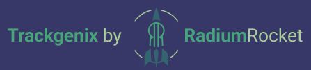

# Become a Software Professional 2022 Radium Rocket

## Index
* [Description](#description)
* [Week 01](#week-01)
* [Week 02](#week-02)
* [Week 03](#week-03)
* [Week 04](#week-04)
* [Week 05](#week-05)
* [Week 06](#week-06)
* [Author](#author)

## Description
 This repository is for a course project about a website called Trackgenix where you can to organize your team's projects and their respective times. The objective of this project is to get in touch with all layers of web development and to be able to create a website from scratch.
 * 🧰 Technologies and tools used:
 | `Slack` | `Figma` | `Visual Studio Code` | `Git` | `GitHub` | `HTML5` | `CSS` | `JavaScript` | `DOM Manipulation` | `Fetch` | `Promises`
 * 🔨 Advance on website:
 | UI Design: All site | HTML: Landing page | CSS: Responsive landing page | JavaScript: Validations with DOM | JavaScript: Fetch into an API |

## Week 01
### 🤝🏻 Get to know each other and start working on UI
 On first week we focused on Figma to get an UI to work with. We worked on subteams focused in some especific pages but adapting our contents to the global view of the site from the team perspective.
 * 🧰 | `Slack` | `Figma` |
 * 🔨 | UI Design: All site |

## Week 02
### 📎 Introduction to tags and SEO in HTML
 This week we individually made and tag the HTML file for the landing page, following what we put on Figma. Then we pushed it to Github.
 * 🧰 | `Visual Studio Code` | `HTML5` | `Git` | `GitHub` |
 * 🔨 | HTML: Landing page |

## Week 03
### 🤿 Diving into CSS Cascade
[GitHub Pages](https://mr-valen.github.io/BaSP-A2022-Etapa-1/Week-03/index.html)

On this week we worked on our individual projects adding styles with CSS's most basic properties, trying to achieve a pixel perfect appereance relative to Figma sheet.
 * 🧰 | `CSS` | `Git` | `GitHub` |
 * 🔨 | CSS: Landing page |

## Week 04
### 💪 Flexing them all
[GitHub Pages](https://mr-valen.github.io/BaSP-A2022-Etapa-1/Week-04/index.html)

After the introduce to CSS we started working on a responsive design, adapting our page to mobile, tablet and desktop screens.
 * 🧰 | `CSS` | `Git` | `GitHub` |
 * 🔨 | CSS: Responsive landing page |

## Week 05
### 💡 Introduction to Javascript Functions
[GitHub Pages](https://mr-valen.github.io/BaSP-A2022-Etapa-1/Week-05/index.html)

Before using JavaScript on our page we worked on five exercise about JavaScript's principles.
 * 🧰 | `JavaScript` | `Git` | `GitHub` |
 * 🔨 | JavaScript: Exercises |

## Week 06
### 👑 DOM Manipulation, the basics
[GitHub Pages](https://mr-valen.github.io/BaSP-A2022-Etapa-1/Week-06/views/index.html)

[Requeriment Validations](https://docs.google.com/document/d/1shSMdqbjs1Z8MgemvnrWqU2IU2zt1X7F3AfY3f0ytiA/edit)

Now that we learned about JavaScript we started working on the site by adding validations to the Login page.
 * 🧰 | `JavaScript` | `DOM Manipulation` | `Git` | `GitHub` |
 * 🔨 | JavaScript: Validations with DOM |

## Week 07
### 💌 Fetch, sending a promise
[GitHub Pages](https://mr-valen.github.io/BaSP-A2022-Etapa-1/Week-07/views/index.html)

On this week we learned how to make a request using fetching into an external API.
 * 🧰 | `JavaScript` | `Fetch` | `Promises` | `Git` | `GitHub` |
 * 🔨 | JavaScript: Fetch into an API |

 ## Author
 Created by Valentín Michilena [@mr-valen](https://github.com/mr-valen)
