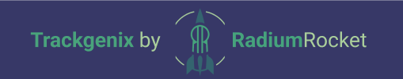

# Become a Software Professional 2022 Radium Rocket

####[GitHub Pages](https://mr-valen.github.io/BaSP-A2022-Etapa-1/Semana-02/index.html)
 This repository is for a course project about a website called Trackgenix where you can to organize your team's projects and their respective times. The objective of this project is to get in touch with all layers of web development and to be able to create a website from scratch.
 * 🧰 Technologies and tools used: | `Slack` | `Figma` | `Visual Studio Code` | `HTML5` | `Git` | `GitHub` |
 * 🔨 Advance on website: | UI Design: All site | HTML: Landing page |

## Weeks index
* [Week 01](#week-01)
* [Week 02](#week-02)

## Week 01 
### Get to know each other and start working on UI
 On first week we focused on Figma to get an UI to work with. We worked on subteams focused in some especific pages but adapting our contents to the global view of the site from the team perspective.
 * 🧰 | `Slack` | `Figma` |
 * 🔨 | UI Design: All site |

## Week 02 
### Introduction to tags and SEO in HTML
 In this week we individually made and tag the HTML file for the landing page, following what we put on Figma. Then we pushed it to Github.
 * 🧰 | `Visual Studio Code` | `HTML5` | `Git` | `GitHub` |
 * 🔨 | HTML: Landing page |

 ## Author
 Created by Valentín Michilena [@mr-valen](https://github.com/mr-valen)